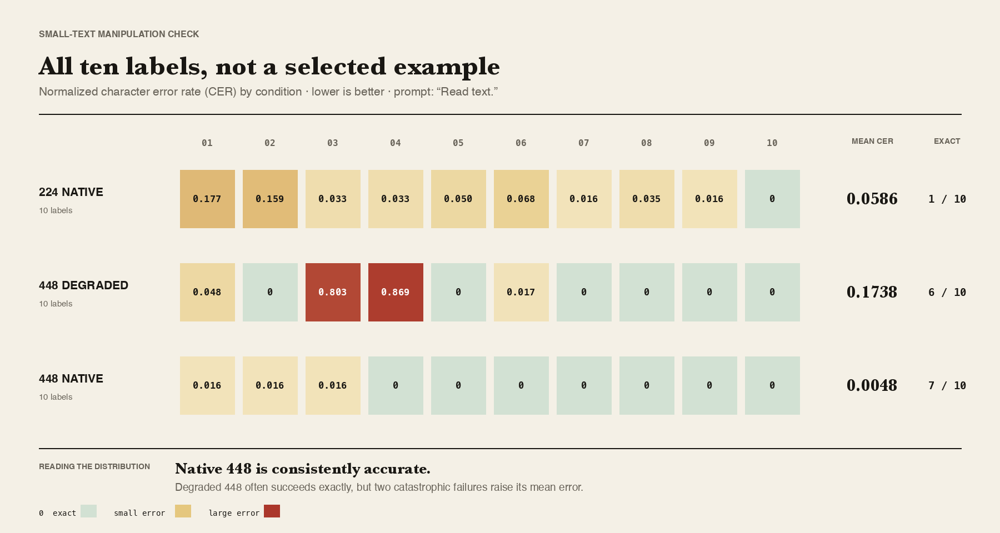

# Small-text manipulation check

Run date: 2026-10-08

## Question

The Renaissance-painting experiment gave native and degraded 448 inputs the
same correctness score on 50 of 60 questions. One possible explanation is that
most questions concerned details that were already visible at 224×224. This
calibration asks whether the degradation control can produce a measurable
difference when the task genuinely depends on small text.

## Design

- Ten deterministic synthetic museum-label cards at 448×448.
- Five lines per card, set in Arial at sizes from 10 to 20 pixels.
- Invented names and catalog codes reduce the usefulness of memorized text.
- Exact reference transcription is known for every card.
- Prompt: `Read text.`
- Greedy decoding with at most 64 generated tokens.
- Apple M4 Max, 36 GB unified memory, PyTorch MPS, float16.
- Character error rate (CER) is computed after lowercasing, Unicode NFKC
  normalization, and collapsing whitespace. Punctuation is retained.

| Condition | Checkpoint | Input |
|---|---|---|
| 224 native | PaliGemma 2 3B/224 | Original card processed at 224×224 |
| 448 degraded | PaliGemma 2 3B/448 | Card reduced to 224×224, then enlarged to 448×448 |
| 448 native | PaliGemma 2 3B/448 | Original card processed at 448×448 |

## Results

| Condition | Mean CER ↓ | Median CER ↓ | Exact matches | Median latency |
|---|---:|---:|---:|---:|
| 224 native | 0.0586 | 0.0336 | 1/10 | 1.026 s |
| 448 degraded | 0.1738 | 0.0000 | 6/10 | 1.762 s |
| 448 native | **0.0048** | **0.0000** | **7/10** | 1.821 s |

In the paired native-448 versus degraded-448 comparison, native 448 had lower
CER on four cards, degraded 448 had lower CER on one, and five tied. The degraded
mean is driven by two catastrophic failures: it returned only `east gallery` for
one card and `unanswerable` for another. Native 448 transcribed both cards almost
or completely correctly.

The calibration therefore shows that the degradation procedure can remove
information that the native 448 model can use. The 50 ties in the painting
experiment should not be interpreted as evidence that the control is incapable
of creating a difference. They are more plausibly related to the particular
paintings, questions, and coarse 0–2 grading scale.

At the same time, the result is not a general OCR benchmark. It contains only ten
synthetic cards in one typeface. Exact-match count also tells a different story
from mean CER: degraded 448 exactly transcribed six cards, compared with one for
224, but failed badly on two others.

## Prompt robustness

A pilot used the longer prompt `Read all text exactly as written.` Native 448 and
224 produced nearly the same transcriptions as under the primary prompt, but the
degraded 448 condition returned the same refusal for all ten cards. Its mean CER
rose to 0.8630. This prompt sensitivity suggests that degraded inputs can place
the model near a behavioral boundary; it is an additional limitation rather than
evidence that every degraded image is unreadable.

Raw outputs for both prompts are included under `data/outputs/`. The image cards
are generated deterministically by `scripts/run_small_text_check.py` and remain
excluded from Git with the other source images.
